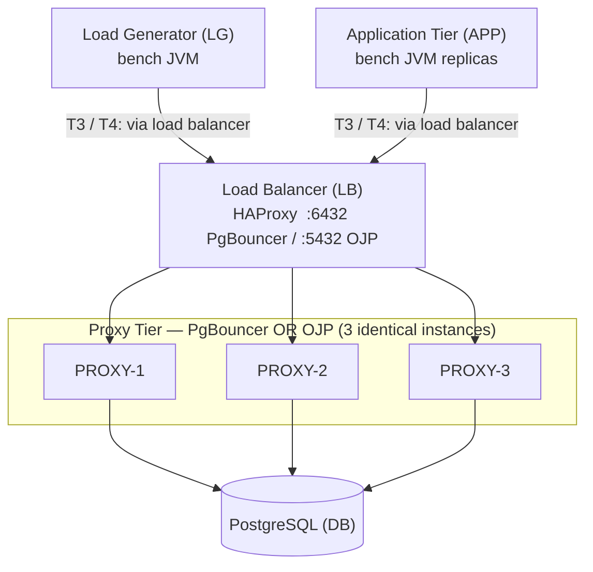
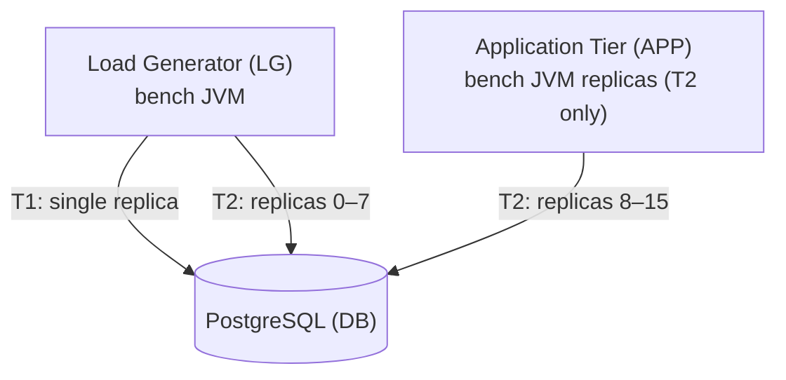

# OJP and PgBouncer Benchmarking Guide

## Purpose

This document provides a complete, step-by-step protocol for benchmarking OJP (Open JDBC Pooler)
and PgBouncer using the OJP Performance Tester Tool. It specifies the deployment topology,
hardware requirements, software configuration, workload definitions, load levels, acceptance
criteria, and analysis procedures required to produce data suitable for publication in a
peer-reviewed venue.

All instructions are prescriptive. Deviations from the specified configuration must be documented
in the experimental report along with a justification.

---

## Table of Contents

1. [Test Environment Topology](#1-test-environment-topology)
2. [Hardware Specifications](#2-hardware-specifications)
3. [Software Installation](#3-software-installation)
4. [PostgreSQL Configuration](#4-postgresql-configuration)
5. [PgBouncer Configuration](#5-pgbouncer-configuration)
6. [OJP Configuration](#6-ojp-configuration)
7. [Database Initialisation](#7-database-initialisation)
8. [Environment Snapshot](#8-environment-snapshot)
9. [Test Scenarios](#9-test-scenarios)
   - [T1 — Baseline: Direct JDBC (HIKARI_DIRECT)](#t1--baseline-direct-jdbc-hikari_direct)
   - [T2 — Disciplined Pooling (HIKARI_DISCIPLINED)](#t2--disciplined-pooling-hikari_disciplined)
   - [T3 — PgBouncer Transaction Mode](#t3--pgbouncer-transaction-mode)
   - [T4 — OJP Server-Side Pooling](#t4--ojp-server-side-pooling)
   - [T5 — Capacity Sweep (All SUTs)](#t5--capacity-sweep-all-suts)
   - [T6 — Overload and Recovery](#t6--overload-and-recovery)
10. [Measurement Collection](#10-measurement-collection)
11. [Expected Outcomes and Acceptance Criteria](#11-expected-outcomes-and-acceptance-criteria)
12. [Analysis Procedure](#12-analysis-procedure)
13. [Known Limitations](#13-known-limitations)

---

## 1. Test Environment Topology

The full proxy-tier topology (scenarios T3 and T4) requires seven physically separate machines
connected by a dedicated 10 Gbps Ethernet switch: LG, APP, LB, PROXY-1, PROXY-2, PROXY-3, and
DB. The baseline topology (scenarios T1 and T2) requires only LG, APP (T2 only), and DB. No
machine plays more than one role. Internet access is not required and must be disabled on all
machines during the test run to eliminate background noise.

The proxy tier runs **three** instances of the proxy under test (PgBouncer or OJP). A hardware or
software load balancer distributes client connections across the three instances. This three-node
topology is the unit of comparison: results for PgBouncer are collected with three PgBouncer
instances behind a load balancer, and results for OJP are collected with three OJP instances
behind the same load balancer.

### Full Topology (T3 — PgBouncer, T4 — OJP)



### Baseline Topology (T1 — HIKARI_DIRECT, T2 — HIKARI_DISCIPLINED)



**Machine roles:**

| Label | Role | Processes |
|-------|------|-----------|
| LG    | Load generator | `bench run` JVM process (1 per replica) |
| APP   | Application tier | `bench run` JVM process for multi-replica runs (T2 only) |
| LB    | Load balancer | HAProxy; distributes client connections to PROXY-1/2/3 |
| PROXY-1 | Connection proxy (instance 1) | `pgbouncer` or `ojp-server` |
| PROXY-2 | Connection proxy (instance 2) | `pgbouncer` or `ojp-server` |
| PROXY-3 | Connection proxy (instance 3) | `pgbouncer` or `ojp-server` |
| DB    | Database server | `postgresql` |

For the baseline HIKARI_DIRECT (T1) and HIKARI_DISCIPLINED (T2) scenarios the proxy tier and load
balancer are idle; the `bench` process on LG (and APP for T2) connects directly to DB.

For the PgBouncer (T3) and OJP (T4) scenarios the connection path is:
LG → LB → PROXY-{1,2,3} → DB.

The load balancer distributes new connections to proxy instances using the least-connections
algorithm. Each of the three proxy instances maintains an independent backend connection pool of
100 connections, giving a total of 300 backend connections to PostgreSQL across the proxy tier.

Single-replica runs execute entirely on LG; the APP machine is used only for multi-replica runs.

---

## 2. Hardware Specifications

The following specifications define the **minimum** hardware to be used for a study intended for
publication. Using lower specifications is acceptable only if every SUT runs on identical hardware.

### 2.1 Load Generator (LG)

| Component | Specification |
|-----------|---------------|
| CPU | 8 physical cores, ≥3.0 GHz base clock (e.g., Intel Xeon E-2288G or AMD EPYC 7302P) |
| RAM | 32 GB ECC DDR4-2666 |
| Network | 10 GbE NIC (single port, direct-attached to switch) |
| Storage | Any (not performance-critical for LG) |
| OS | Ubuntu 22.04 LTS, kernel 5.15 or later |
| JVM | OpenJDK 21.0.x, G1GC, `-Xms4g -Xmx8g -XX:+UseG1GC` |

### 2.2 Application Tier (APP)

Same specification as LG. Used for multi-replica runs where 8–16 JVM replicas are distributed
across LG and APP.

### 2.3 Proxy Tier (PROXY-1, PROXY-2, PROXY-3)

Three identical machines. The same software (PgBouncer or OJP) is deployed on each.

| Component | Specification |
|-----------|---------------|
| CPU | 8 physical cores, ≥3.0 GHz base clock |
| RAM | 16 GB ECC DDR4-2666 |
| Network | 10 GbE NIC |
| Storage | Any |
| OS | Ubuntu 22.04 LTS, kernel 5.15 or later |

PgBouncer is single-threaded; a single core at 3 GHz can sustain approximately 50,000 simple
transactions per second. The 8-core specification allows headroom for the OS and network interrupt
handlers.

OJP resource requirements depend on the implementation; allocate the same hardware as for
PgBouncer unless OJP documentation specifies otherwise.

### 2.4 Load Balancer (LB)

| Component | Specification |
|-----------|---------------|
| CPU | 4 physical cores, ≥2.5 GHz base clock |
| RAM | 8 GB DDR4 |
| Network | 10 GbE NIC |
| Storage | Any |
| OS | Ubuntu 22.04 LTS, kernel 5.15 or later |
| Software | HAProxy 2.8 or later |

HAProxy in TCP mode adds less than 0.05 ms round-trip overhead on a 10 GbE LAN at the load levels
used in this benchmark. This overhead is identical for PgBouncer and OJP scenarios and therefore
cancels out in the comparative analysis.

### 2.5 Database Server (DB)

| Component | Specification |
|-----------|---------------|
| CPU | 16 physical cores, ≥3.0 GHz base clock (e.g., AMD EPYC 7302P × 2) |
| RAM | 128 GB ECC DDR4-3200 |
| Storage (data) | NVMe SSD, ≥1 TB, ≥500 K random IOPS (e.g., Samsung PM9A3, Intel P5800X) |
| Storage (WAL) | Separate NVMe SSD, ≥200 GB (prevents WAL writes from competing with data reads) |
| Network | 10 GbE NIC |
| OS | Ubuntu 22.04 LTS, kernel 5.15 or later |

**Rationale for 128 GB RAM:** The large dataset used in this benchmark (see Section 7) is
approximately 60–80 GB. Allocating 64 GB to `shared_buffers` ensures that steady-state queries
execute entirely from cache, isolating the connection-pooling layer from disk I/O variability.
Researchers who intentionally wish to measure I/O-bound behaviour should reduce `shared_buffers`
to 8 GB and document this deviation.

---

## 3. Software Installation

### 3.1 Build the Benchmark Tool

On LG (and APP if used for multi-replica tests):

```bash
git clone https://github.com/rrobetti/ojp-performance-tester-tool.git
cd ojp-performance-tester-tool
./gradlew installDist
export BENCH="$(pwd)/build/install/ojp-performance-tester/bin/bench"
```

Verify:
```bash
$BENCH --version
```

### 3.2 Install PostgreSQL 16 on DB

```bash
sudo apt-get install -y postgresql-16 postgresql-16-contrib
```

Verify:
```bash
psql --version   # Must report 16.x
```

### 3.3 Install HAProxy on LB

```bash
sudo apt-get install -y haproxy
haproxy -v   # Must report 2.8 or later
```

Configure `/etc/haproxy/haproxy.cfg` for PgBouncer (T3) and OJP (T4) scenarios. The two
configurations are mutually exclusive; swap them between scenario runs.

**haproxy.cfg — PgBouncer frontend (T3):**

```
global
    maxconn 10000

defaults
    mode    tcp
    timeout connect 5s
    timeout client  300s
    timeout server  300s

frontend pgbouncer_front
    bind *:6432
    default_backend pgbouncer_back

backend pgbouncer_back
    balance leastconn
    server proxy1 <PROXY1_IP>:6432 check inter 2s
    server proxy2 <PROXY2_IP>:6432 check inter 2s
    server proxy3 <PROXY3_IP>:6432 check inter 2s
```

**haproxy.cfg — OJP frontend (T4):**

```
global
    maxconn 10000

defaults
    mode    tcp
    timeout connect 5s
    timeout client  300s
    timeout server  300s

frontend ojp_front
    bind *:5432
    default_backend ojp_back

backend ojp_back
    balance leastconn
    server proxy1 <PROXY1_IP>:5432 check inter 2s
    server proxy2 <PROXY2_IP>:5432 check inter 2s
    server proxy3 <PROXY3_IP>:5432 check inter 2s
```

Reload HAProxy after configuration changes:
```bash
sudo systemctl reload haproxy
```

### 3.4 Install PgBouncer on PROXY-1, PROXY-2, PROXY-3

```bash
sudo apt-get install -y pgbouncer
pgbouncer --version  # Must report 1.21 or later
```

### 3.5 Install OJP on PROXY-1, PROXY-2, PROXY-3

Follow the OJP project installation instructions on each of PROXY-1, PROXY-2, and PROXY-3. OJP
must be reachable on port 5432 on each machine.

---

## 4. PostgreSQL Configuration

### 4.1 Create Benchmark User and Database

```bash
sudo -u postgres psql <<'EOF'
CREATE DATABASE benchdb;
CREATE USER benchuser WITH PASSWORD 'benchpass';
GRANT ALL PRIVILEGES ON DATABASE benchdb TO benchuser;
\c benchdb
GRANT ALL ON SCHEMA public TO benchuser;
EOF
```

### 4.2 postgresql.conf — Recommended Settings

Edit `/etc/postgresql/16/main/postgresql.conf`:

```ini
# Memory
shared_buffers            = 64GB
effective_cache_size      = 100GB
work_mem                  = 64MB
maintenance_work_mem      = 4GB

# WAL
wal_buffers               = 64MB
min_wal_size              = 4GB
max_wal_size              = 16GB
checkpoint_completion_target = 0.9

# Parallelism
max_worker_processes      = 16
max_parallel_workers      = 16
max_parallel_workers_per_gather = 4

# Connections
max_connections           = 400
# Reserve 10 connections for superuser maintenance.
# The proxy tier uses 3 × 100 = 300 backend connections.
# Remaining 90 connections provide headroom for monitoring and maintenance.

# Statistics
shared_preload_libraries  = 'pg_stat_statements'
pg_stat_statements.track  = all
pg_stat_statements.max    = 10000
track_io_timing           = on
track_activity_query_size = 2048

# Storage
random_page_cost          = 1.1     # NVMe SSD
effective_io_concurrency  = 256
```

### 4.3 pg_hba.conf

Allow password authentication from all load-generator and proxy machines:

```
host  benchdb  benchuser  <LG_IP>/32      scram-sha-256
host  benchdb  benchuser  <APP_IP>/32     scram-sha-256
host  benchdb  benchuser  <PROXY1_IP>/32  scram-sha-256
host  benchdb  benchuser  <PROXY2_IP>/32  scram-sha-256
host  benchdb  benchuser  <PROXY3_IP>/32  scram-sha-256
```

### 4.4 Restart and Verify

```bash
sudo systemctl restart postgresql
psql -U benchuser -d benchdb -c "CREATE EXTENSION IF NOT EXISTS pg_stat_statements;"
psql -U benchuser -d benchdb -c "SELECT version();"
```

---

## 5. PgBouncer Configuration

The following configuration is applied identically to PROXY-1, PROXY-2, and PROXY-3. Each
instance connects directly to the PostgreSQL server and maintains an independent backend pool of
100 connections. The aggregate backend-connection count across the three instances is 300, which
matches `max_connections - 100` reserved on the DB server.

### 5.1 /etc/pgbouncer/pgbouncer.ini (apply on each of PROXY-1, PROXY-2, PROXY-3)

```ini
[databases]
benchdb = host=<DB_IP> port=5432 dbname=benchdb

[pgbouncer]
listen_addr          = *
listen_port          = 6432
auth_type            = scram-sha-256
auth_file            = /etc/pgbouncer/userlist.txt
pool_mode            = transaction
max_client_conn      = 2000
default_pool_size    = 100
reserve_pool_size    = 10
reserve_pool_timeout = 5
server_idle_timeout  = 600
client_idle_timeout  = 0
log_connections      = 0
log_disconnections   = 0
log_pooler_errors    = 1
stats_period         = 60
ignore_startup_parameters = extra_float_digits
```

**Parameter rationale:**

- `pool_mode = transaction`: This is the only mode that achieves meaningful connection
  multiplexing. Session mode provides no multiplexing benefit over direct pooling; statement mode
  is incompatible with multi-statement transactions and explicit transaction boundaries.
- `default_pool_size = 100`: Each PgBouncer instance holds 100 backend connections. With 3
  instances behind the load balancer, the total backend connection count is 300.
- `max_client_conn = 2000`: Allows up to 2000 concurrent client-side TCP connections per
  PgBouncer instance, which is more than sufficient for all test scenarios in this benchmark.
- `ignore_startup_parameters = extra_float_digits`: Required for the PostgreSQL JDBC driver ≥42.2,
  which sends `extra_float_digits=3` in the startup message; PgBouncer rejects unknown parameters
  by default.

### 5.2 userlist.txt (apply on each of PROXY-1, PROXY-2, PROXY-3)

```
"benchuser" "benchpass"
```

### 5.3 Start PgBouncer on All Three Instances

```bash
# Run on PROXY-1, PROXY-2, and PROXY-3 (in parallel or sequentially)
sudo systemctl start pgbouncer
sudo systemctl enable pgbouncer
```

Verify each instance from LG:
```bash
psql -h <PROXY1_IP> -p 6432 -U benchuser -d benchdb -c "SELECT 1;"
psql -h <PROXY2_IP> -p 6432 -U benchuser -d benchdb -c "SELECT 1;"
psql -h <PROXY3_IP> -p 6432 -U benchuser -d benchdb -c "SELECT 1;"
```

Verify via load balancer:
```bash
# Repeat several times to confirm least-connections distribution across instances
psql -h <LB_IP> -p 6432 -U benchuser -d benchdb -c "SELECT 1;"
```

---

## 6. OJP Configuration

The following configuration is applied identically to PROXY-1, PROXY-2, and PROXY-3. Each OJP
instance connects directly to the PostgreSQL server and maintains an independent backend pool of
100 connections. The aggregate backend-connection count across the three instances is 300.

Follow the OJP deployment documentation on each proxy machine. Each OJP instance must:

- Accept connections on `<PROXYn_IP>:5432`
- Proxy to `<DB_IP>:5432`, database `benchdb`, user `benchuser`
- Be configured with a maximum backend connection count of 100

Verify each instance from LG:

```bash
psql -h <PROXY1_IP> -p 5432 -U benchuser -d benchdb -c "SELECT 1;"
psql -h <PROXY2_IP> -p 5432 -U benchuser -d benchdb -c "SELECT 1;"
psql -h <PROXY3_IP> -p 5432 -U benchuser -d benchdb -c "SELECT 1;"
```

Verify via load balancer:
```bash
psql -h <LB_IP> -p 5432 -U benchuser -d benchdb -c "SELECT 1;"
```

---

## 7. Database Initialisation

The following dataset sizes are specified to ensure that the working set substantially exceeds a
32 GB shared_buffers configuration but fits within a 64 GB configuration. This allows researchers
to run both cache-resident and I/O-bound variants by changing only `shared_buffers`.

```bash
$BENCH init-db \
  --jdbc-url "jdbc:postgresql://<DB_IP>:5432/benchdb" \
  --username benchuser \
  --password benchpass \
  --accounts 1000000 \
  --items    100000 \
  --orders   10000000 \
  --seed     42
```

| Table | Row count | Approximate size |
|-------|-----------|-----------------|
| accounts | 1,000,000 | ~150 MB |
| items | 100,000 | ~15 MB |
| orders | 10,000,000 | ~2 GB |
| order_lines (avg 3 per order) | ~30,000,000 | ~8 GB |
| Indexes | — | ~12 GB |
| **Total** | | **~22 GB** |

Verify row counts:

```bash
psql -h <DB_IP> -U benchuser -d benchdb <<'EOF'
SELECT relname, n_live_tup
  FROM pg_stat_user_tables
 ORDER BY n_live_tup DESC;
EOF
```

After initialisation, run `ANALYZE` to ensure up-to-date statistics:

```bash
psql -h <DB_IP> -U benchuser -d benchdb -c "ANALYZE;"
```

---

## 8. Environment Snapshot

Before any benchmark run, capture the full environment on every machine:

**On LG:**
```bash
$BENCH env-snapshot \
  --output results/env/ \
  --label LG \
  --postgres-conf-path /dev/null   # Not applicable on LG
```

**On DB:**
```bash
$BENCH env-snapshot \
  --output results/env/ \
  --label DB \
  --postgres-conf-path /etc/postgresql/16/main/postgresql.conf
```

**On PROXY-1, PROXY-2, PROXY-3:**
```bash
# Run on each proxy machine (adjust label accordingly)
$BENCH env-snapshot \
  --output results/env/ \
  --label PROXY-1   # Change to PROXY-2 / PROXY-3 on the respective machines
```

Store the `env-snapshot.json` files alongside all result files. The snapshot records CPU model,
core count, total RAM, OS version, kernel version, JVM version and flags, JDBC driver version,
and git commit hash of the benchmark tool.

Also record PgBouncer and OJP version on each proxy machine:

```bash
pgbouncer --version >> results/env/proxy-versions.txt
ojp-server --version >> results/env/proxy-versions.txt  # Adjust to actual OJP binary name
```

Record the HAProxy version on LB:
```bash
haproxy -v >> results/env/lb-version.txt
```

---

## 9. Test Scenarios

All test scenarios share the following global parameters unless explicitly overridden:

| Parameter | Value |
|-----------|-------|
| `dbConnectionBudget` | 300 (100 per proxy instance × 3 instances) |
| `warmupSeconds` | 300 |
| `cooldownSeconds` | 120 |
| `repeatCount` | 5 |
| `seed` | 42 |
| `useZipf` | false |
| `metricsIntervalSeconds` | 1 |
| `sloP95Ms` | 50 |
| `errorRateThreshold` | 0.001 |

The `warmupSeconds: 300` warm-up phase primes PostgreSQL's buffer pool and the JIT compiler. The
warm-up window is not included in any reported metric. The `repeatCount: 5` repetitions at each
configuration point allow the median p95 to be computed, reducing the influence of a single
anomalous run.

### T1 — Baseline: Direct JDBC (HIKARI_DIRECT)

**Purpose:** Establish the performance of direct JDBC connection pooling without any proxy.
This is the upper-bound baseline. To ensure a fair comparison with T3 and T4 (which collectively
use 300 backend connections), the T1 pool size is also set to 300.

**Connection path:** LG → DB (direct)

**Configuration file:** `configs/t1-hikari-direct.yaml`

```yaml
database:
  jdbcUrl: "jdbc:postgresql://<DB_IP>:5432/benchdb"
  username: "benchuser"
  password: "benchpass"

connectionMode: HIKARI_DIRECT
poolSize: 300   # matches total proxy backend connections in T3/T4 for a fair comparison
dbConnectionBudget: 300
replicas: 1

workload:
  type: W2_MIXED
  openLoop: true
  targetRps: 1000
  warmupSeconds: 300
  durationSeconds: 600
  cooldownSeconds: 120
  repeatCount: 5
  writePercent: 0.20
  useZipf: false
  seed: 42

numAccounts: 1000000
numItems:    100000
numOrders:   10000000

metricsIntervalSeconds: 1
outputDir: "results/t1-hikari-direct"
sloP95Ms: 50
errorRateThreshold: 0.001
```

**Run command:**
```bash
$BENCH run --config configs/t1-hikari-direct.yaml
```

**Metrics to record:** throughput (RPS), p50, p95, p99, p999 latency, error rate.

---

### T2 — Disciplined Pooling (HIKARI_DISCIPLINED)

**Purpose:** Measure the effect of dividing the connection budget equally among multiple replicas,
without any external proxy. This tests the hypothesis that disciplined pooling (small pool per
replica) performs comparably to a single large pool.

**Connection path:** LG + APP → DB (direct, 16 replicas)

**Configuration file:** `configs/t2-disciplined-16.yaml`

```yaml
database:
  jdbcUrl: "jdbc:postgresql://<DB_IP>:5432/benchdb"
  username: "benchuser"
  password: "benchpass"

connectionMode: HIKARI_DISCIPLINED
dbConnectionBudget: 100
replicas: 16
maxPoolSizePerReplica: 20

workload:
  type: W2_MIXED
  openLoop: true
  targetRps: 63    # Per-replica rate; 16 × 63 ≈ 1000 RPS aggregate
  warmupSeconds: 300
  durationSeconds: 600
  cooldownSeconds: 120
  repeatCount: 5
  writePercent: 0.20
  useZipf: false
  seed: 42

numAccounts: 1000000
numItems:    100000
numOrders:   10000000

metricsIntervalSeconds: 1
outputDir: "results/t2-disciplined"
sloP95Ms: 50
errorRateThreshold: 0.001
```

**Run command (execute on each machine, stagger starts by ≤2 seconds):**
```bash
# On LG (replicas 0–7)
for i in {0..7}; do
  $BENCH run --config configs/t2-disciplined-16.yaml --instance-id $i \
    --output results/t2-disciplined/ &
done

# On APP (replicas 8–15) — execute in parallel with the LG command above
for i in {8..15}; do
  $BENCH run --config configs/t2-disciplined-16.yaml --instance-id $i \
    --output results/t2-disciplined/ &
done

wait
```

**Note:** The aggregate throughput target is 16 × 63 = 1,008 RPS. After the run, sum
`achievedThroughputRps` across all 16 `summary.json` files to obtain the aggregate throughput.

---

### T3 — PgBouncer Transaction Mode (3 Instances)

**Purpose:** Measure the throughput and latency of a JDBC workload routed through three PgBouncer
instances in transaction pooling mode. Each instance holds 100 backend connections; total backend
connections to PostgreSQL = 300. Client connections are distributed across the three instances by
HAProxy using the least-connections algorithm.

**Connection path:** LG → LB (HAProxy:6432) → PROXY-{1,2,3} (PgBouncer:6432) → DB

**Configuration file:** `configs/t3-pgbouncer.yaml`

```yaml
database:
  # Point to HAProxy load balancer, not directly to a PgBouncer instance
  jdbcUrl: "jdbc:postgresql://<LB_IP>:6432/benchdb"
  username: "benchuser"
  password: "benchpass"

connectionMode: PGBOUNCER
poolSize: 2    # Minimal client-side connections; PgBouncer holds the real pool

workload:
  type: W2_MIXED
  openLoop: true
  targetRps: 1000
  warmupSeconds: 300
  durationSeconds: 600
  cooldownSeconds: 120
  repeatCount: 5
  writePercent: 0.20
  useZipf: false
  seed: 42

numAccounts: 1000000
numItems:    100000
numOrders:   10000000

metricsIntervalSeconds: 1
outputDir: "results/t3-pgbouncer"
sloP95Ms: 50
errorRateThreshold: 0.001
```

**Run command:**
```bash
$BENCH run --config configs/t3-pgbouncer.yaml
```

**PgBouncer monitoring during the test (run on each PROXY machine in a separate terminal):**
```bash
# Run this command on PROXY-1, PROXY-2, and PROXY-3 simultaneously
watch -n 5 "psql -p 6432 -U benchuser pgbouncer -c 'SHOW POOLS;' && \
            psql -p 6432 -U benchuser pgbouncer -c 'SHOW STATS;'"
```

Record `cl_active`, `cl_waiting`, `sv_active`, `sv_idle` from `SHOW POOLS` on each instance at
least every 60 seconds during the steady-state window. Sum `cl_active` and `sv_active` across all
three instances to obtain aggregate values.

---

### T4 — OJP Server-Side Pooling (3 Instances)

**Purpose:** Measure the throughput and latency of a JDBC workload using three OJP instances with
no client-side HikariCP pool. Each OJP instance maintains a backend pool of 100 connections; total
backend connections to PostgreSQL = 300. Client connections are distributed across the three
instances by HAProxy using the least-connections algorithm.

**Connection path:** LG → LB (HAProxy:5432) → PROXY-{1,2,3} (OJP:5432) → DB

**Configuration file:** `configs/t4-ojp.yaml`

```yaml
database:
  # Point to HAProxy load balancer, not directly to an OJP instance
  jdbcUrl: "jdbc:postgresql://<LB_IP>:5432/benchdb"
  username: "benchuser"
  password: "benchpass"

connectionMode: OJP
dbConnectionBudget: 100   # Client-side connection budget for the bench load generator (1 replica)
replicas: 1

ojp:
  virtualConnectionMode: PER_WORKER
  poolSharing: PER_INSTANCE
  minConnections: 5
  connectionTimeoutMs: 30000
  idleTimeoutMs: 600000
  maxLifetimeMs: 1800000
  queueLimit: 1000

workload:
  type: W2_MIXED
  openLoop: true
  targetRps: 1000
  warmupSeconds: 300
  durationSeconds: 600
  cooldownSeconds: 120
  repeatCount: 5
  writePercent: 0.20
  useZipf: false
  seed: 42

numAccounts: 1000000
numItems:    100000
numOrders:   10000000

metricsIntervalSeconds: 1
outputDir: "results/t4-ojp"
sloP95Ms: 50
errorRateThreshold: 0.001
```

**Run command:**
```bash
$BENCH run --config configs/t4-ojp.yaml
```

---

### T5 — Capacity Sweep (All SUTs)

**Purpose:** Determine the maximum sustainable throughput (MST) for each SUT, defined as the
highest load level at which median p95 latency across all five repetitions remains below the SLO
threshold (50 ms) and the error rate remains below 0.1%.

The sweep starts at 20% of the initial `targetRps` value and increments by 15% at each step until
two consecutive steps violate the SLO.

**Run the sweep for each SUT:**

```bash
# T1 baseline
$BENCH sweep --config configs/t1-hikari-direct.yaml \
  --sweep-start-rps 200 \
  --sweep-increment-percent 15 \
  --output results/sweep-t1/

# T3 PgBouncer
$BENCH sweep --config configs/t3-pgbouncer.yaml \
  --sweep-start-rps 200 \
  --sweep-increment-percent 15 \
  --output results/sweep-t3/

# T4 OJP
$BENCH sweep --config configs/t4-ojp.yaml \
  --sweep-start-rps 200 \
  --sweep-increment-percent 15 \
  --output results/sweep-t4/
```

**Expected output per sweep:** a `sweep-summary.json` file containing the load level at each step,
the median p95 latency, and whether the SLO was violated.

**Reporting:** For each SUT, report the MST as the highest load level that did not violate the SLO
at the preceding step. Pair the MST with the median p95 latency at that level.

---

### T6 — Overload and Recovery

**Purpose:** Measure the time required for p95 latency to return to SLO-compliant levels after a
sustained overload episode. This test is the primary differentiator between SUTs with respect to
queue management and backpressure behaviour.

**Protocol:**

1. From T5, identify the MST for each SUT (call it R_max RPS).
2. For this test, set:
   - Overload level: 1.30 × R_max RPS (130% of MST)
   - Recovery level: 0.70 × R_max RPS (70% of MST)
3. The test consists of three phases within a single continuous run:
   - **Warm-up**: 300 s at 0.70 × R_max (system reaches stable state)
   - **Overload**: 300 s at 1.30 × R_max (system is stressed)
   - **Recovery**: 600 s at 0.70 × R_max (system returns to steady state)

**Metric of interest — Recovery Time:** The number of seconds from the moment load drops to
0.70 × R_max until the first second S such that:
- p95 latency in second S is below the SLO threshold (50 ms), AND
- p95 latency in every subsequent second from S to the end of the recovery window is also below the
  SLO threshold.

If p95 latency never returns below the SLO threshold within the 600-second recovery window, the
recovery time is recorded as >600 s.

**Run the overload test for each SUT:**

```bash
# Substitute <R_MAX_T1>, <R_MAX_T3>, <R_MAX_T4> with the values found in T5.

# T1 baseline
$BENCH overload \
  --config configs/t1-hikari-direct.yaml \
  --overload-rps <1.30 * R_MAX_T1>  \
  --recovery-rps <0.70 * R_MAX_T1>  \
  --overload-seconds 300             \
  --recovery-seconds 600             \
  --output results/t6-overload-t1/

# T3 PgBouncer
$BENCH overload \
  --config configs/t3-pgbouncer.yaml \
  --overload-rps <1.30 * R_MAX_T3>  \
  --recovery-rps <0.70 * R_MAX_T3>  \
  --overload-seconds 300             \
  --recovery-seconds 600             \
  --output results/t6-overload-t3/

# T4 OJP
$BENCH overload \
  --config configs/t4-ojp.yaml       \
  --overload-rps <1.30 * R_MAX_T4>  \
  --recovery-rps <0.70 * R_MAX_T4>  \
  --overload-seconds 300             \
  --recovery-seconds 600             \
  --output results/t6-overload-t4/
```

**Computing recovery time from timeseries.csv:**

The `timeseries.csv` file contains one row per second with columns including `wallTimeSeconds`,
`p95Ms`, and `errorRate`. The recovery window starts at the second where `wallTimeSeconds` exceeds
the end of the overload phase (300 + 300 = 600 s from steady-state start).

```python
import pandas as pd

df = pd.read_csv("results/t6-overload-t3/timeseries.csv")

recovery_start_s = 600   # seconds from steady-state start
slo_p95_ms       = 50.0

recovery = df[df["wallTimeSeconds"] >= recovery_start_s].reset_index(drop=True)

recovered_idx = None
for i, row in recovery.iterrows():
    if row["p95Ms"] < slo_p95_ms:
        # Check that all subsequent rows also satisfy SLO
        if (recovery.iloc[i:]["p95Ms"] < slo_p95_ms).all():
            recovered_idx = i
            break

if recovered_idx is not None:
    recovery_time_s = recovery.loc[recovered_idx, "wallTimeSeconds"] - recovery_start_s
    print(f"Recovery time: {recovery_time_s:.0f} s")
else:
    print("Recovery time: >600 s (SLO not reached within recovery window)")
```

**Additional metrics to extract from T6:**

| Metric | Definition |
|--------|------------|
| Overload peak p99 | Maximum p99 latency during the 300-second overload phase |
| Overload error rate | Mean error rate during the overload phase |
| Queue drain time | Time from load reduction until `cl_waiting = 0` in `SHOW POOLS` (PgBouncer) |
| Recovery time | As defined above |

---

## 10. Measurement Collection

### 10.1 Output Structure

Each `bench run` or `bench overload` command produces the following files in the output directory:

```
results/
  {scenario}/
    raw/
      {timestamp}/
        {SUT_MODE}/
          {workload}/
            instance_{N}/
              timeseries.csv    # Per-second metrics
              summary.json      # Run metadata and final statistics
              latency.hdr       # HdrHistogram binary log
```

### 10.2 Before Each Run

Reset PostgreSQL statistics to ensure that `pg_stat_statements` data is not polluted by previous
runs:

```bash
psql -h <DB_IP> -U benchuser -d benchdb <<'EOF'
SELECT pg_stat_statements_reset();
SELECT pg_stat_reset();
EOF
```

### 10.3 After Each Run

Collect PostgreSQL statistics:

```bash
psql -h <DB_IP> -U benchuser -d benchdb <<'EOF'
\copy (
  SELECT query, calls, mean_exec_time, stddev_exec_time, rows,
         total_exec_time, blk_read_time, blk_write_time
  FROM pg_stat_statements
  WHERE query NOT LIKE 'SELECT pg_stat%'
  ORDER BY total_exec_time DESC LIMIT 50
) TO STDOUT CSV HEADER
EOF
```

Save to `results/{scenario}/pg_stat_statements.csv`.

### 10.4 Required Metrics for Publication

The following metrics must be reported for each SUT and each scenario:

| Metric | Source |
|--------|--------|
| Mean achieved throughput (RPS) | `summary.json → achievedThroughputRps` |
| p50 latency (ms) | `summary.json → p50Ms` |
| p95 latency (ms) | `summary.json → p95Ms` |
| p99 latency (ms) | `summary.json → p99Ms` |
| p999 latency (ms) | `summary.json → p999Ms` |
| Maximum latency (ms) | `summary.json → maxMs` |
| Error rate | `summary.json → errorRate` |
| Error breakdown | `summary.json → errorsByType` |
| Maximum sustainable throughput | `sweep-summary.json` |
| Recovery time (T6 only) | Computed from `timeseries.csv` |

---

## 11. Expected Outcomes and Acceptance Criteria

The following predictions are stated prior to running the experiments. Their confirmation or
refutation is the scientific contribution of the study. These are not thresholds that determine
whether results are "good enough" to publish; they are falsifiable hypotheses.

### 11.1 Steady-State Throughput (T1–T4)

**Hypothesis H1:** At 1,000 RPS with a total backend connection budget of 300 (100 per proxy
instance for T3/T4, or a single pool of 300 for T1):

| SUT | Predicted p95 relative to T1 | Predicted throughput relative to T1 |
|-----|-------------------------------|--------------------------------------|
| T1 HIKARI_DIRECT | baseline | baseline |
| T2 HIKARI_DISCIPLINED (K=16) | +5 to +20% higher latency per replica | ≈ aggregate baseline |
| T3 PGBOUNCER (3 instances) | +2 to +10% higher latency (LB hop + proxy) | ≈ baseline |
| T4 OJP (3 instances) | +2 to +15% higher latency (LB hop + proxy) | ≈ baseline |

The proxy-hop overhead is expected to be 0.1–0.5 ms per request on a 10 GbE LAN, contributing
less than 1 ms to median latency but potentially more to tail latency under load due to queueing
at the proxy.

### 11.2 Capacity (T5)

**Hypothesis H2:** The maximum sustainable throughput of T3 (3 × PgBouncer) is within 10% of T1
(HIKARI_DIRECT) when the total backend connection count is held constant at 300. The load balancer
adds a fixed and symmetric overhead to both T3 and T4 and does not affect the PgBouncer-vs-OJP
comparison. PgBouncer's transaction-mode multiplexing is designed precisely to avoid the
connection serialisation that limits throughput; if connection establishment cost is low
(cache-warm, no SSL), the overhead should be minimal.

**Hypothesis H3:** The maximum sustainable throughput of T4 (3 × OJP) is within 10% of T3
(3 × PgBouncer) when each proxy instance is configured with equal backend pool sizes (100 per
instance). Both are transaction-mode multiplexers running behind the same load balancer.
Differences, if observed, are attributable to implementation-specific overheads (protocol
translation, queue management, JVM overhead in OJP if applicable).

### 11.3 Overload and Recovery (T6)

**Hypothesis H4:** Under a 300-second, 130% overload episode:

| SUT | Predicted recovery time |
|-----|------------------------|
| T1 HIKARI_DIRECT | 5–30 s (HikariCP connection queue drains quickly after load drops) |
| T3 PGBOUNCER (3 instances) | 5–60 s (PgBouncer `cl_waiting` queue drains across 3 instances; total queue = 3 × reserve_pool_size) |
| T4 OJP (3 instances) | 5–60 s (OJP queue drains across 3 instances; depends on `queueLimit` per instance) |

Recovery time is expected to correlate with the length of the request queue at the moment load is
reduced. A system with large queue buffers (high `max_client_conn` in PgBouncer or high
`queueLimit` in OJP) will accumulate more queued requests during overload and therefore take longer
to drain. A system that drops requests (connection pool exhaustion) will have a shorter apparent
queue but a higher error rate during overload.

**The trade-off between queue depth, error rate during overload, and recovery time is a primary
finding of this study.**

### 11.4 Prepared Statement Overhead (Cross-cutting)

**Hypothesis H5:** PgBouncer in transaction mode causes measurable overhead relative to HIKARI_DIRECT
in scenarios where the workload heavily uses the PostgreSQL extended query protocol (prepared
statements). This overhead, if present, will manifest as increased p99 latency and will be larger
for the W2_READ_WRITE workload (which uses explicit multi-statement transactions) than for the
W1_READ_ONLY workload (single-statement transactions).

---

## 12. Analysis Procedure

### 12.1 Throughput–Latency Curves

For each SUT, plot the throughput–latency curve using sweep data from T5:

- X axis: offered load (RPS), from T5 sweep
- Y axis: p95 latency (ms), log scale
- Mark the MST point with a vertical dashed line
- Overlay curves for T1, T3, and T4 on the same axes for direct comparison

### 12.2 CDF Plots

For each point at or near the MST, plot the cumulative latency distribution using the HdrHistogram
`.hdr` files:

```bash
# Use the HdrHistogram HistogramLogProcessor (available from the hdrhistogram project)
java -cp hdrhistogram-tools.jar \
  org.HdrHistogram.HistogramLogProcessor \
  -i results/t3-pgbouncer/raw/.../latency.hdr \
  -o results/t3-pgbouncer-cdf.csv
```

Plot percentile (log scale) on X axis against latency (ms) on Y axis.

### 12.3 Recovery Time Plot (T6)

For each SUT, plot the per-second p95 latency timeseries from `timeseries.csv`:

- X axis: time (seconds), with t=0 at steady-state start
- Y axis: p95 latency (ms)
- Add vertical lines at t=300 (overload start), t=600 (recovery start)
- Add horizontal dashed line at SLO threshold (50 ms)
- The recovery time for each SUT is the distance between t=600 and the point where the timeseries
  crosses back below the SLO line and remains there

### 12.4 Statistical Reporting

Because each scenario is repeated 5 times, report:

- Median (50th percentile) of achieved throughput across 5 runs
- Median p95 latency across 5 runs
- Inter-quartile range (IQR) of p95 latency across 5 runs as a measure of run-to-run variability
- For T6, report recovery time from a single run (T6 is inherently transient and is not amenable
  to simple repetition averaging)

Do not use arithmetic mean of latency percentiles across runs. Means of percentiles are
mathematically incoherent. Use the median run's p95 value or, if HDR histogram merging is
implemented, compute the aggregate p95 from the merged histogram.

---

## 13. Known Limitations

The following limitations are inherent to the current tool implementation. They must be disclosed
in any publication that uses these results.

1. **Open-loop scheduling approximation.** The load generator uses
   `ScheduledExecutorService.scheduleAtFixedRate`, which provides relative-time scheduling. Under
   saturation, the JVM thread pool may queue tasks faster than they can be executed, causing a
   burst of requests when the saturation clears. True open-loop scheduling requires absolute
   time-based injection with explicit "missed opportunity" tracking. This limitation means that
   results at loads above MST should be interpreted with caution; the observed latency may
   underestimate the true steady-state latency under overload.

2. **No replica synchronisation barrier.** In multi-replica runs (T2), each replica starts
   independently. The actual aggregate load during the first 5–10 seconds of steady state may be
   lower than intended. The measurement window excludes the warm-up phase, but the transition from
   warm-up to steady state is not barrier-synchronised. The per-second timeseries can be inspected
   to verify that aggregate RPS reaches the intended level within 10 seconds of steady-state start.

3. **Per-interval percentiles in timeseries.csv are cumulative.** The p95 value in each row of
   `timeseries.csv` is the p95 of the cumulative histogram from the start of the measurement
   window, not from the start of that one-second interval. For T1–T5 (steady-state analysis) this
   does not affect the final summary statistics. For T6 (recovery analysis) it means that the
   per-second p95 values in `timeseries.csv` are smoothed by history and will underestimate the
   instantaneous p95 during the recovery transition. The reported recovery time is therefore a
   conservative (longer) estimate.

4. **No automatic cross-replica aggregation.** For T2, the aggregate throughput must be computed
   manually by summing `achievedThroughputRps` across all 16 `summary.json` files. The `aggregate`
   command is a placeholder and does not implement HDR histogram merging.

5. **No JVM or DB server metrics collected automatically.** CPU utilisation, GC pause duration,
   and `pg_stat_activity` data must be collected separately using OS-level tools (`vmstat`, `iostat`,
   `pgBadger`, or `pg_activity`). This tool captures latency and throughput from the client
   perspective only.

---

*Document version: 1.0 — February 2026*
