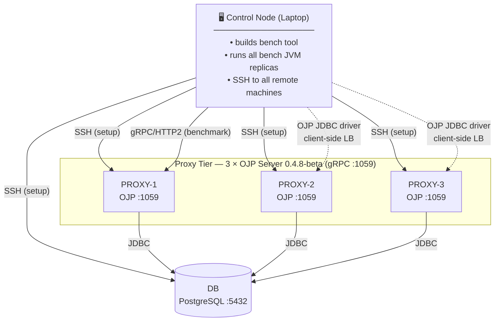

# Single Control-Node Deployment Guide

Step-by-step instructions for deploying and running the OJP Performance Benchmark from a
**single control node** (your laptop) against pre-provisioned remote machines.

## Assumptions

| # | Assumption |
|---|------------|
| 1 | All remote machines are already provisioned with a Linux OS and accessible via SSH. |
| 2 | Your laptop (the **control node**) has SSH access to every remote machine. |
| 3 | Every machine has unrestricted outbound internet access (`curl`, `apt-get`, etc. work). |
| 4 | OJP version **0.4.8-beta** is used for both the server and the JDBC driver. |
| 5 | The `bench` tool is **built and run on the control node only**. No bench process is deployed on remote machines. |
| 6 | The OJP Server requires **Java 21+** on each proxy node. The control node (bench tool) requires **Java 11+**. |

---

## Table of Contents

1. [Architecture Overview](#1-architecture-overview)
2. [Machine Inventory](#2-machine-inventory)
3. [Control Node Prerequisites](#3-control-node-prerequisites)
4. [Remote Setup — Database Server (DB)](#4-remote-setup--database-server-db)
5. [Remote Setup — OJP Proxy Nodes (PROXY-1, 2, 3)](#5-remote-setup--ojp-proxy-nodes-proxy-1-2-3)
6. [Build the Benchmark Tool (Control Node)](#6-build-the-benchmark-tool-control-node)
7. [Initialise the Benchmark Database](#7-initialise-the-benchmark-database)
8. [Start OJP Servers (via SSH)](#8-start-ojp-servers-via-ssh)
9. [Run Benchmarks from the Control Node](#9-run-benchmarks-from-the-control-node)
10. [Verify and Collect Results](#10-verify-and-collect-results)
11. [Teardown](#11-teardown)

---

## 1. Architecture Overview



**Key differences from the full multi-machine topology:**

| Full topology | This guide |
|---|---|
| 16 bench JVMs split across LG-1 + LG-2 | All bench JVMs run on the control node |
| Separate load-generator machines required | No LG machines required |
| Results reflect a multi-host client tier | Suitable for functional validation and OJP scenario testing |

---

## 2. Machine Inventory

Fill in your actual IP addresses or hostnames before proceeding.

| Label | Role | SSH address |
|-------|------|-------------|
| CTRL | Control node — your laptop | *(local)* |
| DB | PostgreSQL database server | `<DB_IP>` |
| PROXY-1 | OJP server node 1 | `<PROXY1_IP>` |
| PROXY-2 | OJP server node 2 | `<PROXY2_IP>` |
| PROXY-3 | OJP server node 3 | `<PROXY3_IP>` |

Export these as shell variables on your control node to use in the commands below:

```bash
export DB_IP=<DB_IP>
export PROXY1_IP=<PROXY1_IP>
export PROXY2_IP=<PROXY2_IP>
export PROXY3_IP=<PROXY3_IP>
export SSH_USER=<your_ssh_username>   # e.g. ubuntu, ec2-user, root
```

---

## 3. Control Node Prerequisites

The control node needs **Java 11+**, **Git**, and **jq** to build and run the benchmark tool
and inspect result files.

### Java 11+ (macOS)

```bash
# Option A — SDKMAN (recommended)
curl -s "https://get.sdkman.io" | bash
source "$HOME/.sdkman/bin/sdkman-init.sh"
sdk install java 21.0.3-tem
sdk default java 21.0.3-tem

# Option B — Homebrew
brew install --cask temurin@21
```

### Java 11+ (Linux)

```bash
sudo apt-get update
sudo apt-get install -y wget apt-transport-https gpg
wget -qO - https://packages.adoptium.net/artifactory/api/gpg/key/public \
    | gpg --dearmor | sudo tee /etc/apt/trusted.gpg.d/adoptium.gpg > /dev/null
echo "deb https://packages.adoptium.net/artifactory/deb $(. /etc/os-release; echo $VERSION_CODENAME) main" \
    | sudo tee /etc/apt/sources.list.d/adoptium.list
sudo apt-get update
sudo apt-get install -y temurin-21-jdk
```

### jq (macOS)

```bash
brew install jq
```

### jq (Linux)

```bash
sudo apt-get install -y jq
```

### Verify

```bash
java -version   # Must report 11 or higher
git  --version
jq   --version
```

> The Gradle wrapper (`./gradlew`) is bundled in the repository and downloads Gradle
> automatically on first use. No separate Gradle installation is needed.

---

## 4. Remote Setup — Database Server (DB)

All commands in this section are run from your control node over SSH.

### 4.1 Install PostgreSQL 16

```bash
ssh ${SSH_USER}@${DB_IP} bash -s << 'ENDSSH'
# PGDG repository
sudo apt-get install -y curl ca-certificates
sudo install -d /usr/share/postgresql-common/pgdg
curl -o /usr/share/postgresql-common/pgdg/apt.postgresql.org.asc \
    --fail https://www.postgresql.org/media/keys/ACCC4CF8.asc
sudo sh -c 'echo "deb [signed-by=/usr/share/postgresql-common/pgdg/apt.postgresql.org.asc] \
    https://apt.postgresql.org/pub/repos/apt $(lsb_release -cs)-pgdg main" \
    > /etc/apt/sources.list.d/pgdg.list'
sudo apt-get update
sudo apt-get install -y postgresql-16 postgresql-16-contrib postgresql-client-16
sudo systemctl start postgresql
sudo systemctl enable postgresql
ENDSSH
```

### 4.2 Create benchmark database and user

```bash
ssh ${SSH_USER}@${DB_IP} sudo -u postgres psql << 'ENDSQL'
CREATE DATABASE benchdb;
CREATE USER benchuser WITH PASSWORD 'benchpass';
GRANT ALL PRIVILEGES ON DATABASE benchdb TO benchuser;
\c benchdb
GRANT ALL ON SCHEMA public TO benchuser;
ENDSQL
```

### 4.3 Configure PostgreSQL for benchmarking

```bash
ssh ${SSH_USER}@${DB_IP} bash -s << 'ENDSSH'
PG_CONF=/etc/postgresql/16/main/postgresql.conf
sudo tee -a "${PG_CONF}" > /dev/null << 'EOF'

# --- OJP benchmark settings ---
shared_preload_libraries = 'pg_stat_statements'
pg_stat_statements.track = all
pg_stat_statements.max   = 10000
track_io_timing          = on
track_activity_query_size = 2048

shared_buffers          = 4GB
effective_cache_size    = 12GB
maintenance_work_mem    = 1GB
work_mem                = 32MB
wal_buffers             = 16MB
min_wal_size            = 2GB
max_wal_size            = 8GB
checkpoint_completion_target = 0.9
default_statistics_target = 100
random_page_cost        = 1.1
effective_io_concurrency = 200
max_worker_processes    = 8
max_parallel_workers_per_gather = 4
max_parallel_workers    = 8
max_connections         = 400
EOF

sudo systemctl restart postgresql
ENDSSH
```

### 4.4 Allow remote connections from the control node

```bash
ssh ${SSH_USER}@${DB_IP} bash -s << ENDSSH
PG_HBA=/etc/postgresql/16/main/pg_hba.conf
# Allow benchuser from any host (restrict to a CIDR in production)
echo "host  benchdb  benchuser  0.0.0.0/0  md5" | sudo tee -a "\${PG_HBA}"
sudo sed -i "s/#listen_addresses = 'localhost'/listen_addresses = '*'/" \
    /etc/postgresql/16/main/postgresql.conf
sudo systemctl reload postgresql
ENDSSH
```

### 4.5 Verify connectivity from the control node

```bash
psql -h "${DB_IP}" -p 5432 -U benchuser -d benchdb -c "SELECT version();"
```

Expected: PostgreSQL 16.x version string.

---

## 5. Remote Setup — OJP Proxy Nodes (PROXY-1, 2, 3)

Repeat the following block for each proxy IP. The example uses a shell loop for convenience.

```bash
for PROXY_IP in "${PROXY1_IP}" "${PROXY2_IP}" "${PROXY3_IP}"; do
  echo "=== Setting up OJP on ${PROXY_IP} ==="
  ssh ${SSH_USER}@${PROXY_IP} bash -s << ENDSSH

# Install Java 21 (OJP Server requires Java 21+)
sudo apt-get update
sudo apt-get install -y wget apt-transport-https gpg
wget -qO - https://packages.adoptium.net/artifactory/api/gpg/key/public \
    | gpg --dearmor | sudo tee /etc/apt/trusted.gpg.d/adoptium.gpg > /dev/null
echo "deb https://packages.adoptium.net/artifactory/deb \$(. /etc/os-release; echo \$VERSION_CODENAME) main" \
    | sudo tee /etc/apt/sources.list.d/adoptium.list
sudo apt-get update
sudo apt-get install -y temurin-21-jdk

# Create OJP directories
sudo mkdir -p /opt/ojp/bin /opt/ojp/ojp-libs

# Download OJP Server 0.4.8-beta shaded JAR
sudo curl -L \
  https://repo1.maven.org/maven2/org/openjproxy/ojp-server/0.4.8-beta/ojp-server-0.4.8-beta-shaded.jar \
  -o /opt/ojp/bin/ojp-server-0.4.8-beta-shaded.jar

# Download PostgreSQL JDBC driver
sudo curl -L \
  https://repo1.maven.org/maven2/org/postgresql/postgresql/42.7.8/postgresql-42.7.8.jar \
  -o /opt/ojp/ojp-libs/postgresql-42.7.8.jar

# Verify
java -version
ls -lh /opt/ojp/bin/ /opt/ojp/ojp-libs/
ENDSSH
done
```

---

## 6. Build the Benchmark Tool (Control Node)

```bash
# Clone the repository (if not already done)
git clone https://github.com/rrobetti/ojp-performance-tester-tool.git
cd ojp-performance-tester-tool

# Build and create the runnable distribution
./gradlew installDist

# Verify the executable
build/install/ojp-performance-tester/bin/bench --help
```

Add a convenience alias for the session:

```bash
alias bench="$(pwd)/build/install/ojp-performance-tester/bin/bench"
```

---

## 7. Initialise the Benchmark Database

Run from the control node, targeting the remote DB machine:

```bash
bench init-db \
  --jdbc-url "jdbc:postgresql://${DB_IP}:5432/benchdb" \
  --username benchuser \
  --password benchpass \
  --accounts 10000 \
  --items    5000 \
  --orders   50000 \
  --seed     42
```

Verify the data was loaded:

```bash
psql -h "${DB_IP}" -p 5432 -U benchuser -d benchdb \
  -c "SELECT 'accounts' AS tbl, COUNT(*) FROM accounts
      UNION ALL SELECT 'items', COUNT(*) FROM items
      UNION ALL SELECT 'orders', COUNT(*) FROM orders;"
```

Expected row counts: 10000 / 5000 / 50000.

---

## 8. Start OJP Servers (via SSH)

Start the OJP server as a background process on each proxy node, providing the DB connection
details through JVM system properties.

```bash
for PROXY_IP in "${PROXY1_IP}" "${PROXY2_IP}" "${PROXY3_IP}"; do
  echo "=== Starting OJP on ${PROXY_IP} ==="
  ssh ${SSH_USER}@${PROXY_IP} bash -s << ENDSSH
nohup java -Duser.timezone=UTC \
           -Dojp.libs.path=/opt/ojp/ojp-libs \
           -Dojp.server.port=1059 \
           -jar /opt/ojp/bin/ojp-server-0.4.8-beta-shaded.jar \
           > /var/log/ojp-server.log 2>&1 &
echo "OJP PID: \$!"

# Wait a moment then confirm the port is open
sleep 3
ss -tlnp | grep 1059 && echo "OJP is listening on :1059" || echo "ERROR: OJP not found on :1059"
ENDSSH
done
```

### Verify gRPC connectivity from the control node

```bash
for PROXY_IP in "${PROXY1_IP}" "${PROXY2_IP}" "${PROXY3_IP}"; do
  nc -zv "${PROXY_IP}" 1059 && echo "OK: ${PROXY_IP}:1059" || echo "FAIL: ${PROXY_IP}:1059"
done
```

All three should report `succeeded`.

---

## 9. Run Benchmarks from the Control Node

Create a benchmark configuration pointing to the three OJP proxy nodes and the remote DB:

```bash
cat > /tmp/ojp-benchmark.yaml << YAML
database:
  jdbcUrl: "jdbc:ojp[${PROXY1_IP}:1059,${PROXY2_IP}:1059,${PROXY3_IP}:1059]_postgresql://${DB_IP}:5432/benchdb"
  username: "benchuser"
  password: "benchpass"

connectionMode: OJP

ojp:
  maximumPoolSize: 16
  minimumIdle: 4
  connectionTimeout: 15000

workload:
  type: W2_MIXED
  openLoop: true
  targetRps: 500
  warmupSeconds: 60
  durationSeconds: 300
  cooldownSeconds: 30

outputDir: "results/ojp-run-1"
YAML
```

### Warmup (recommended before each measurement run)

```bash
bench warmup --config /tmp/ojp-benchmark.yaml
```

### Run the benchmark

```bash
bench run --config /tmp/ojp-benchmark.yaml --output results/ojp-run-1/
```

### Run multiple replica instances (simulate horizontal scale)

To simulate multiple application replicas from a single machine, launch several bench
processes in parallel, each with a distinct `--instance-id`:

```bash
mkdir -p results/ojp-multi
for ID in 0 1 2 3; do
  bench run \
    --config /tmp/ojp-benchmark.yaml \
    --output "results/ojp-multi/replica-${ID}/" \
    --instance-id "${ID}" &
done
wait
echo "All replicas finished"
```

> **Tip:** Keep the number of parallel bench JVMs proportional to the available CPU cores on
> your laptop to avoid the control node becoming the bottleneck. Four replicas is a good
> starting point for a modern 8-core laptop.

---

## 10. Verify and Collect Results

```bash
# List result files
ls -lh results/ojp-run-1/

# Quick summary
jq . results/ojp-run-1/summary.json
```

Key files produced per run:

| File | Contents |
|------|----------|
| `summary.json` | p50 / p95 / p99 latencies, throughput, error rate |
| `timeseries.csv` | Per-second metrics (RPS, latency percentiles) |
| `histogram.hlog` | HDR histogram log for offline analysis |

See [RESULTS_FORMAT.md](RESULTS_FORMAT.md) for the full schema.

---

## 11. Teardown

### Stop OJP servers

```bash
for PROXY_IP in "${PROXY1_IP}" "${PROXY2_IP}" "${PROXY3_IP}"; do
  ssh ${SSH_USER}@${PROXY_IP} "pkill -f ojp-server-0.4.8-beta-shaded.jar && echo 'OJP stopped on ${PROXY_IP}'"
done
```

### Reset database statistics (before the next run)

```bash
psql -h "${DB_IP}" -p 5432 -U benchuser -d benchdb << 'EOF'
SELECT pg_stat_statements_reset();
SELECT pg_stat_reset();
EOF
```

---

## Further Reading

| Document | Purpose |
|----------|---------|
| [../ansible/README.md](../ansible/README.md) | **Ansible automation** — one-command install, run, collect, report |
| [BENCHMARKING_GUIDE.md](BENCHMARKING_GUIDE.md) | Full multi-machine protocol for publishable results |
| [RUNBOOK.md](RUNBOOK.md) | Complete command reference for all SUT modes |
| [CONFIG.md](CONFIG.md) | All benchmark configuration parameters |
| [RESULTS_FORMAT.md](RESULTS_FORMAT.md) | Output file schemas and metrics methodology |
| [METRICS.md](METRICS.md) | What every metric is, how it is collected, workload SQL |
| [install/OJP.md](install/OJP.md) | OJP Server installation reference |
| [install/OJP_JDBC_DRIVER.md](install/OJP_JDBC_DRIVER.md) | OJP JDBC Driver reference |
| [PARAMETER_DECISIONS.md](PARAMETER_DECISIONS.md) | Rationale for every numeric constant |

---

*Back to [README.md](../README.md)*
