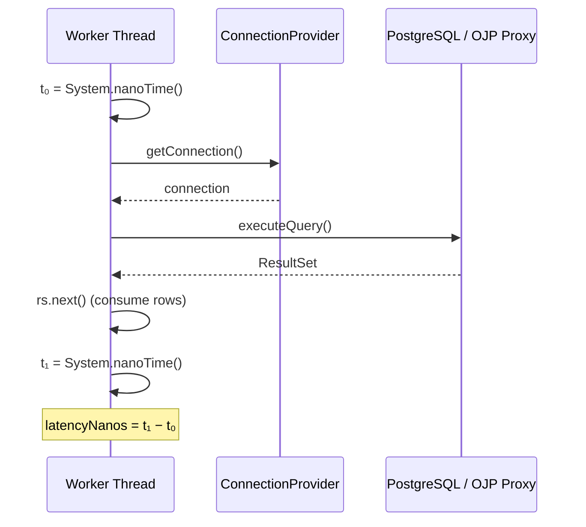
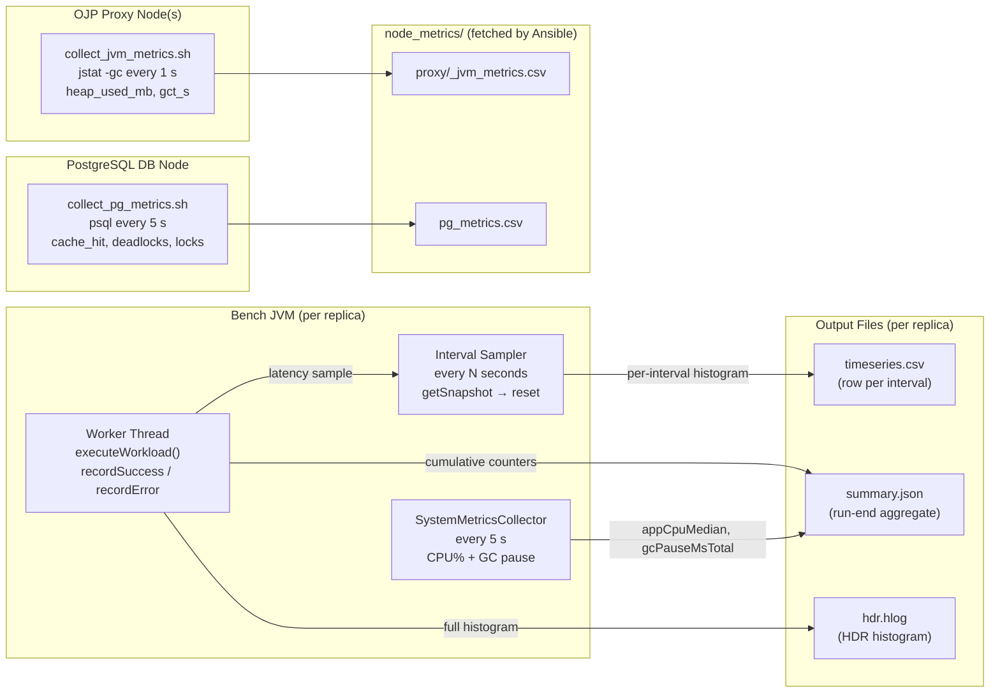
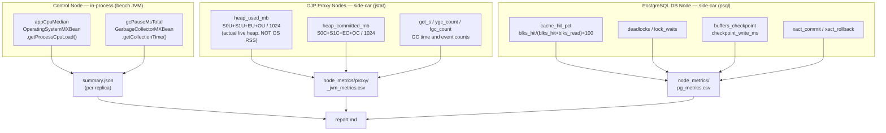

# Metrics Reference — What Is Measured and How

This document has two parts:

- **[Section 0](#0-reading-the-report--field-reference)** — Plain-English reference for every field in the benchmark report, organized in the same order they appear. Start here if you want to understand what you are reading.
- **Sections 1–9** — Technical details: how the measurement clock works, the collection pipeline, output file schemas, workload SQL, and known limitations.

---

## Table of Contents

0. [Reading the Report — Field Reference](#0-reading-the-report--field-reference)
   - [Report Header](#report-header)
   - [Aggregate Metrics](#aggregate-metrics)
   - [Connection Budget — Configured and Observed](#connection-budget--configured-and-observed)
   - [Topology-Specific Summary](#topology-specific-summary)
   - [Bench JVM System Metrics](#bench-jvm-system-metrics)
   - [SLO Evaluation](#slo-evaluation)
   - [Per-Instance Breakdown](#per-instance-breakdown)
   - [Error Breakdown](#error-breakdown)
   - [PostgreSQL — Database Statistics](#postgresql--database-statistics)
   - [Process Resource Utilization](#process-resource-utilization)
   - [OJP Proxy — JVM Heap and GC Metrics (OJP runs only)](#ojp-proxy--jvm-heap-and-gc-metrics-ojp-runs-only)
1. [Measurement Scope (What the Latency Clock Covers)](#1-measurement-scope)
2. [Collection Pipeline — How Metrics Flow](#2-collection-pipeline)
3. [Output Files](#3-output-files)
   - [timeseries.csv — Per-second metrics](#timeseriescvs)
   - [summary.json — Aggregate metrics](#summaryjson)
   - [hdr.hlog — HDR histogram log](#hdrhlog)
4. [Metric Catalogue — Bench Client (Currently Collected)](#4-metric-catalogue)
   - [Latency metrics](#latency-metrics)
   - [Throughput metrics](#throughput-metrics)
   - [Error metrics](#error-metrics)
   - [Open-loop correctness metrics](#open-loop-correctness-metrics)
   - [OJP-specific metrics](#ojp-specific-metrics)
5. [Node-Level Metrics — Collection Status and Gaps](#5-node-level-metrics)
   - [Bench / control node](#bench--control-node)
   - [OJP proxy node — JVM heap vs OS RSS](#ojp-proxy-node--jvm-heap-vs-os-rss)
   - [PostgreSQL DB node](#postgresql-db-node)
6. [Workload Operations (What Generates Load)](#6-workload-operations)
7. [Environment Snapshot](#7-environment-snapshot)
8. [Multi-Replica Aggregation](#8-multi-replica-aggregation)
9. [Limitations and Known Issues](#9-limitations-and-known-issues)

---

## 0. Reading the Report — Field Reference

This section explains every field that appears in the benchmark report, in the
order they appear. For deeper technical details see sections 1–9 below.

---

### Report Header

| Field | What it means |
|-------|---------------|
| **SUT** | System Under Test — the database connection stack being benchmarked (e.g. `HIKARI_DISCIPLINED`, `OJP`, `PGBOUNCER`). |
| **Workload** | The query mix used (e.g. `W1_READ_ONLY`, `W2_MIXED`, `W3_SLOW_QUERY`). See [§6](#6-workload-operations) for the SQL details. |
| **Run time** | UTC timestamp when the benchmark started. |
| **Duration** | Length of the steady-state measurement window in seconds. Warmup and cooldown phases are excluded from all metrics. |
| **Instances** | Number of parallel bench JVM replicas. Each runs independently and sends load to the database. |
| **Target RPS** | Requested operations per second per instance. The open-loop dispatcher submits work at this rate regardless of how quickly the database responds. |
| **Results dir** | Local path where all output files (CSVs, histograms, this report) are stored. |

---

### Aggregate Metrics

Computed across all instances. Latency percentiles are the arithmetic mean of
per-instance values (each instance builds its own histogram over the full
steady-state phase).

| Metric | What it means | How it is collected |
|--------|---------------|---------------------|
| **Achieved throughput** | Actual completed requests per second, per instance (mean across instances). | `achievedThroughputRps` from each `instance_N/summary.json`, averaged. |
| **Total throughput** | Sum of achieved RPS across all instances. | Sum of per-instance `achievedThroughputRps`. |
| **p50 latency** | The median response time — half of all requests finished faster than this. | 50th percentile of the cumulative HDR histogram. |
| **p95 latency** | 95% of requests finished faster than this. This is the primary SLO metric. | 95th percentile of the cumulative HDR histogram. |
| **p99 latency** | 99% of requests finished faster. Reveals tail behaviour. | 99th percentile of the cumulative HDR histogram. |
| **p999 latency** | 99.9% of requests finished faster. Captures extreme outliers. | 99.9th percentile of the cumulative HDR histogram. |
| **Error rate** | Fraction of requests that failed (e.g. `0.001` = 0.1%). | `failedRequests / (completedRequests + failedRequests)`, averaged across instances. |
| **Total requests** | Total requests made during steady state (successes + failures). | Sum of `totalRequests` across all instances. |
| **Failed requests** | Total requests that ended in an error. | Sum of `failedRequests` across all instances. |

> **What latency includes:** time waiting for a free connection from the pool,
> network round-trip to the database (or proxy), query execution on PostgreSQL,
> and reading the result set.  
> **What latency excludes:** OS scheduling jitter between when a task is queued
> and when a worker thread picks it up (tracked separately as
> `openLoopSchedulingDelayMs`).

---

### Connection Budget — Configured and Observed

Compares how many DB connections were configured vs. what PostgreSQL actually saw.

| Field | What it means | Source |
|-------|---------------|--------|
| `configured_db_connection_budget` | Max DB connections the SUT was configured to open. | `runInfo.configuredDbConnectionBudget` in `summary.json`. |
| `observed_postgres_backends_max_numbackends` | Peak total backend connections seen by PostgreSQL during the run. | Maximum value of `pg_stat_database.numbackends`, sampled every 5 s. |
| `observed_postgres_backends_avg_numbackends` | Average total backend connections over the run. | Mean of all `pg_stat_database.numbackends` samples. |
| `observed_postgres_backends_median_numbackends` | Typical total backend connections (less skewed by spikes than the average). | Median of all `pg_stat_database.numbackends` samples. |
| `observed_client_backends_active_median` | Typical number of application connections actively executing a query. | Median of `count(*) WHERE state='active' AND backend_type='client backend'` from `pg_stat_activity`, sampled every 5 s. |
| `observed_client_backends_active_max` | Peak number of application connections actively executing a query. | Maximum of the same query. |
| `observed_client_backends_idle_median` | Typical number of application connections open but idle (not running a query). | Median of `count(*) WHERE state='idle'` from `pg_stat_activity`. |
| `observed_client_backends_idle_max` | Peak idle application connections. | Maximum of the same query. |

> `numbackends` counts all backend processes PostgreSQL knows about, including
> replication slots and autovacuum workers. The `client backends` rows isolate
> only application connections, which is usually the more meaningful number.

---

### Topology-Specific Summary

Describes how the tested stack is configured. Fields that do not apply to the
current topology are shown as `N/A`.

| Field | What it means |
|-------|---------------|
| **Scenario profile** | The Ansible variable file used for this run (e.g. `hikari-prod`, `ojp-prod`). |
| **Configured replicas** | Number of bench JVM replicas that ran in parallel. |
| **Configured client pool size (per replica)** | HikariCP pool size on the bench client. |
| **OJP servers** | Number of OJP proxy server instances in the topology. |
| **Real DB connections per OJP server** | Actual PostgreSQL connections held open by each OJP server. |
| **OJP proxy-tier CPU (avg / peak, summed)** | CPU% summed across all OJP proxy nodes — average over the run / single highest 5-second sample. 100% = 1 fully busy CPU core. |
| **OJP proxy-tier RSS (avg / peak, summed)** | Physical RAM (MiB) summed across all OJP proxy nodes. |
| **PgBouncer nodes** | Number of PgBouncer connection-pooler instances. |
| **PgBouncer server pool size per node** | Max server-side (PostgreSQL-facing) connections per PgBouncer node. |
| **pgbouncer_reserve_pool_size** | Reserve pool size configured in PgBouncer (`reserve_pool_size`). |
| **PgBouncer local HikariCP pool size per replica** | HikariCP pool size on the bench client when connecting via PgBouncer. |
| **HAProxy nodes** | Number of HAProxy load-balancer instances. |
| **PgBouncer tier CPU / RSS** | CPU and RAM for PgBouncer nodes only. |
| **HAProxy CPU / RSS** | CPU and RAM for HAProxy load-balancer nodes. |
| **Total PgBouncer proxy-tier CPU / RSS** | Combined CPU and RAM for PgBouncer + HAProxy together (the full proxy tier). |

> CPU and RSS values for proxy-tier components are collected by
> `collect_proc_metrics.sh`, which polls `ps` every 5 seconds on each node.

---

### Bench JVM System Metrics

Resources consumed by the bench client JVM itself — not the database or proxy.
Collected inside the JVM during the steady-state phase only.

| Metric | What it means | How it is collected |
|--------|---------------|---------------------|
| **Bench JVM CPU (median)** | Median % of one CPU core used by the bench process. | `OperatingSystemMXBean.getProcessCpuLoad()`, sampled every 5 s; median taken across all samples and all instances. |
| **Bench JVM GC pause total** | Total time the JVM spent paused for garbage collection during the run. | `GarbageCollectorMXBean.getCollectionTime()` delta from start to end of steady state, summed across all instances. |

> High GC pause time can inflate latency measurements because the latency clock
> runs inside the same JVM. If GC pause exceeds ~5% of the run duration,
> the bench JVM itself may be a bottleneck.

---

### SLO Evaluation

A simple pass/fail check against two thresholds.

| SLO | Default threshold | What a FAIL means |
|-----|-------------------|-------------------|
| **p95 latency** | < 50 ms | 95% of requests are not completing within the target latency. |
| **Error rate** | < 0.1% (0.001) | More than 1 in 1,000 requests resulted in an error. |

Thresholds can be overridden via arguments to `generate_report.sh`.

---

### Per-Instance Breakdown

Same latency and throughput metrics split by individual bench JVM instance.
Use this to check for outliers — if one instance shows much higher p99 than
others, it may indicate a problem specific to that machine.

| Column | What it means |
|--------|---------------|
| **Instance** | Bench JVM replica index (0-based). |
| **p50 / p95 / p99** | Latency percentiles from this instance's own HDR histogram. |
| **Throughput (RPS)** | Completed requests per second for this instance. |
| **Error Rate** | `failedRequests / totalRequests` for this instance. |
| **CPU (%)** | Median process CPU for this instance's bench JVM. |
| **GC pause (ms)** | Total GC pause time for this instance's bench JVM. |

---

### Error Breakdown

Lists each type of error that occurred, per instance.

| Column | What it means |
|--------|---------------|
| **Instance** | Bench JVM replica index. |
| **Error type** | `sql_exception` = generic JDBC error (e.g. connection refused, pool timeout); `timeout` = query or connection timed out; `other` = unexpected JVM exception. |
| **Count** | Number of times this error occurred in this instance during steady state. |
| **First error message** | The exception message from the first occurrence — useful for diagnosing the root cause. |

---

### PostgreSQL — Database Statistics

Collected by `collect_pg_metrics.sh` running on the DB node, polling PostgreSQL
every 5 s. Statistics are reset with `pg_stat_reset()` at the start of each run
for clean per-run deltas.

| Metric | What it means | Source |
|--------|---------------|--------|
| **PostgreSQL backends (median, `numbackends`)** | Typical total connections to PostgreSQL (all backend types). | Median of `pg_stat_database.numbackends`. |
| **Client backends `state='active'` (median / max)** | Typical / peak application connections actively running a query. | `pg_stat_activity` filtered to `backend_type='client backend'` and `state='active'`. |
| **Client backends `state='idle'` (median / max)** | Typical / peak application connections open but not running a query. | Same, with `state='idle'`. |
| **Buffer cache hit ratio** | % of block reads served from PostgreSQL's in-memory cache (`shared_buffers`). Values below 99% suggest the cache is too small. | `blks_hit / (blks_hit + blks_read) × 100` from `pg_stat_database`. |
| **Transactions committed** | Total committed transactions since stats reset. Should roughly match bench RPS × duration. | `pg_stat_database.xact_commit`. |
| **Transactions rolled back** | Non-zero means contention or application errors are causing rollbacks. | `pg_stat_database.xact_rollback`. |
| **Temp file bytes written** | Bytes written to disk because a sort or hash exceeded `work_mem`. Non-zero suggests increasing `work_mem`. | `pg_stat_database.temp_bytes`. |
| **Deadlocks** | Number of deadlocks detected. Should be 0 for well-behaved OLTP workloads. | `pg_stat_database.deadlocks`. |
| **Peak ungranted lock waits** | Highest instantaneous count of lock requests that were not yet granted. Greater than 0 indicates row-level contention. | `count(*) FROM pg_locks WHERE NOT granted`, peak across all 5-second samples. |
| **Checkpoint buffers written** | Buffers flushed to disk by the checkpointer. High values mean frequent or large checkpoints (WAL/I/O pressure). | `pg_stat_bgwriter.buffers_checkpoint`. |
| **Checkpoint write time (ms)** | Cumulative time PostgreSQL spent writing data during checkpoints. High values indicate I/O-bound checkpoints. | `pg_stat_bgwriter.checkpoint_write_time`. |

---

### Process Resource Utilization

OS-level CPU and memory for each component node, collected by
`collect_proc_metrics.sh` polling `ps` every 5 s on the respective host.

| Column | What it means |
|--------|---------------|
| **Component** | Which part of the stack: `PostgreSQL`, `Proxy (OJP / pgBouncer)`, or `HAProxy`. |
| **Node** | Hostname of the machine. |
| **Avg CPU (%)** | Mean CPU% used by the process over the run. 100% = 1 fully busy CPU core. |
| **Peak CPU (%)** | Highest CPU% seen in any single 5-second sample. |
| **Avg RSS (MiB)** | Mean physical RAM used by the process (Resident Set Size). |
| **Peak RSS (MiB)** | Highest physical RAM seen in any single 5-second sample. |

---

### OJP Proxy — JVM Heap and GC Metrics *(OJP runs only)*

This section appears only when OJP proxy servers are part of the topology.
Heap is measured with `jstat -gc` rather than OS RSS because Java keeps memory
reserved from the OS even after garbage collection — OS RSS would significantly
overstate actual heap usage.

| Column | What it means | Source |
|--------|---------------|--------|
| **Proxy host** | Hostname of the OJP server node. |
| **Heap used — median (MB)** | Typical live heap (actual objects in memory) during the run. | Median of `(S0U + S1U + EU + OU) / 1024` from `jstat -gc`, sampled every second. |
| **Heap committed — median (MB)** | Typical heap capacity reserved from the OS. Always ≥ heap used. | Median of `(S0C + S1C + EC + OC) / 1024` from `jstat -gc`. |
| **Total GC time (s)** | Total seconds the JVM spent in garbage collection during the run. | Final value of `GCT` from `jstat -gc`. |
| **Young GC count** | Number of minor (young-generation) GC events. | Final value of `YGC` from `jstat -gc`. |
| **Full GC count** | Number of full GC events. More than a few per run indicates memory pressure. | Final value of `FGC` from `jstat -gc`. |

---

## 1. Measurement Scope

The latency clock covers **everything the application sees**: connection
acquisition from the pool *plus* the full SQL round-trip, including result-set
consumption.



Source: `LoadGenerator.executeWorkload()` in `src/main/java/com/bench/load/LoadGenerator.java`.

**What is included:** connection-pool wait, TCP round-trip to DB or proxy, query
execution on PostgreSQL, result-set transmission and iteration.

**What is excluded:** JVM scheduling jitter between the dispatcher thread
submitting the task and the worker thread starting it. This overhead is captured
separately as the *scheduling delay* metric (see §4).

---

## 2. Collection Pipeline



There are **two** `MetricsCollector` instances running in parallel inside each bench JVM:

| Collector | Purpose | Reset cadence |
|-----------|---------|---------------|
| `metrics` (cumulative) | Tracks totals from warmup-reset onwards; used for `summary.json`. | After warmup phase. |
| `intervalMetrics` (interval) | Tracks per-sampling-window values; used for `timeseries.csv` percentiles. | After every row is written. |

Using a per-interval histogram guarantees that `p99` in row *N* of the CSV reflects
only requests completed in that specific second, not a diluted value across the whole
run. The cumulative histogram in `hdr.hlog` represents the entire steady-state phase.

The sampling interval is controlled by `metricsIntervalSeconds` (default: **1 second**).

Source: `BenchmarkRunner.java`, lines 80–133.

---

## 3. Output Files

### timeseries.csv

Written in real-time during the **steady-state phase only** (warmup and cooldown
are excluded).

| Column | Unit | Source |
|--------|------|--------|
| `timestamp_iso` | ISO 8601 UTC | Wall clock at time of snapshot |
| `attempted_rps` | req/s | Δ(attempted) ÷ Δt since last row |
| `achieved_rps` | req/s | Δ(completed) ÷ Δt since last row |
| `errors` | count | Δ(errors) in this interval |
| `p50_ms` | ms | HdrHistogram p50 — **interval only** |
| `p95_ms` | ms | HdrHistogram p95 — **interval only** |
| `p99_ms` | ms | HdrHistogram p99 — **interval only** |
| `p999_ms` | ms | HdrHistogram p99.9 — **interval only** |
| `max_ms` | ms | HdrHistogram max — **interval only** |

> Percentiles are derived from the **per-interval histogram** that is reset after
> every row. This prevents percentiles from converging toward a run-average over
> time and allows transient spikes to be visible.

File size: ≈ 100–150 bytes/row → ≈ 60–90 KB for a 600 s run per instance.

---

### summary.json

Written once at the end of each `bench run` invocation. Contains the aggregate
view of the entire steady-state phase (warmup excluded, cooldown included up to
the moment the load generator is stopped).

Key fields:

```
runInfo                         — run context (SUT, workload, instance ID, …)
attemptedRps                    — mean attempted RPS over the measurement window
achievedThroughputRps           — mean completed RPS over the measurement window
errorRate                       — failedRequests / (completedRequests + failedRequests)
latencyMs.{p50,p95,p99,p999,max,mean}  — cumulative histogram percentiles (all requests)
errorsByType.{timeout, sql_exception, other}  — error breakdown
appCpuMedian                    — median application CPU % (optional)
appRssMedian                    — median resident set size in MB (optional)
gcPauseMsTotal                  — total JVM GC pause time in ms (optional)
dbActiveConnectionsMedian       — median active backend connections (optional)
queueDepthMax                   — peak connection-pool queue depth (optional)
```

**Open-loop–specific fields** (present when `openLoop: true`):

```
runInfo.openLoopAttemptedOps         — total operations submitted by dispatcher
runInfo.openLoopMissedOpportunities  — send slots skipped because system fell behind
runInfo.openLoopSchedulingDelayMs    — cumulative dispatcher scheduling delay in ms
```

**OJP-specific fields** (present when `connectionMode: OJP`):

```
runInfo.clientPooling                          — always "none" (server-side pooling)
runInfo.ojpVirtualConnectionMode               — PER_WORKER or PER_OPERATION
runInfo.ojpPoolSharing                         — PER_INSTANCE or SHARED
runInfo.clientVirtualConnectionsOpenedTotal    — total virtual connections opened
runInfo.clientVirtualConnectionsMaxConcurrent  — peak concurrent virtual connections
```

Source: `SummaryWriter.java`, `MetricsSnapshot.java`.

---

### hdr.hlog

An HdrHistogram log file covering the entire steady-state phase. Values are stored
in **microseconds** (1 µs resolution, 3 significant digits).

The file can be analysed offline with standard HdrHistogram tooling:

```bash
# View percentile distribution using the HdrHistogram log processor
java -jar HdrHistogram-2.1.12.jar -i results/run-1/hdr.hlog -outputValueUnitRatio 1000

# Or using the online viewer at https://hdrhistogram.github.io/HdrHistogram/plotFiles.html
```

For multi-replica runs, `HistogramAggregator` merges histograms by **adding
counts** (not averaging percentiles), which is the statistically correct way to
combine independent histograms.

Source: `LatencyRecorder.exportToLog()`, `HistogramAggregator.java`.

---

## 4. Metric Catalogue — Bench Client (Currently Collected)

### Latency metrics

| Metric | Description | Collection method |
|--------|-------------|-------------------|
| **p50** (median) | Half of all requests finish faster than this. | `HdrHistogram.getValueAtPercentile(50.0)` |
| **p95** | 95 % of requests finish faster. Primary SLO threshold (default < 50 ms). | `HdrHistogram.getValueAtPercentile(95.0)` |
| **p99** | 99 % of requests finish faster. Indicates tail behaviour. | `HdrHistogram.getValueAtPercentile(99.0)` |
| **p99.9** | 99.9 % of requests finish faster. Captures extreme outliers. | `HdrHistogram.getValueAtPercentile(99.9)` |
| **max** | Worst single latency observed. | `HdrHistogram.getMaxValue()` |
| **mean** | Arithmetic mean. Less useful than percentiles but included for completeness. | `HdrHistogram.getMean()` |

All latency values are reported in **milliseconds** in the output files. The
histogram stores values internally in **microseconds** for precision.

The highest trackable latency is **60,000 ms** (60 seconds). Any latency
exceeding this is clamped to the maximum bucket. Values this large indicate a
completely saturated system; normal operating range is well below 1 second.

---

### Throughput metrics

| Metric | Description |
|--------|-------------|
| `attempted_rps` | Rate at which the dispatcher submitted operations to the worker pool. For open-loop runs this equals `targetRps` under normal conditions; it drops when the dispatcher itself is CPU-limited. |
| `achieved_rps` | Rate at which operations actually completed (success or error). Under saturation, this decouples from `attempted_rps`. The gap between them measures back-pressure. |
| `errorRate` | `failedRequests ÷ (completedRequests + failedRequests)`. SLO threshold: < 0.001 (0.1 %). |

---

### Error metrics

Errors are classified by the Java exception type caught in `LoadGenerator.executeWorkload()`:

| Key | Exception | Meaning |
|-----|-----------|---------|
| `timeout` | `SQLTimeoutException` | Connection or query exceeded the configured timeout |
| `sql_exception` | `SQLException` (non-timeout) | DB error: constraint violation, deadlock, connection refused |
| `other` | Any other `Exception` | Unexpected JVM error |

Each key appears in `summary.json` under `errorsByType`.

---

### Open-loop correctness metrics

These fields appear in `summary.json > runInfo` when `openLoop: true`.

| Field | Description |
|-------|-------------|
| `openLoopAttemptedOps` | Total send-slots the dispatcher processed. |
| `openLoopMissedOpportunities` | Send-slots skipped because `System.nanoTime()` was already past the scheduled send time by more than one interval. A non-zero value means the system is over capacity. |
| `openLoopSchedulingDelayMs` | Cumulative sum of how many nanoseconds late each dispatch was (divided by 1,000,000 for ms). Captures OS and JVM scheduling jitter. |

The dispatcher uses **absolute time-based scheduling** (`nextSendTimeNanos += intervalNanos`).
When the system falls behind, it records the delay and moves forward — it never
issues a burst of catch-up requests. This is critical for correct open-loop
measurement.

Source: `TrueOpenLoopLoadGenerator.java`.

---

### OJP-specific metrics

| Field | Description |
|-------|-------------|
| `clientVirtualConnectionsOpenedTotal` | Total number of virtual JDBC connections opened from this bench instance to the OJP server during the run. High values in `PER_OPERATION` mode indicate connection churn. |
| `clientVirtualConnectionsMaxConcurrent` | Peak number of virtual connections held open simultaneously. |
| `ojpVirtualConnectionMode` | `PER_WORKER`: one virtual connection per worker thread (low churn). `PER_OPERATION`: open/close per SQL operation (tests connection setup overhead). |
| `ojpPoolSharing` | `PER_INSTANCE`: each bench JVM gets its own server-side pool (size = `dbConnectionBudget`). `SHARED`: all replicas share one pool (size = `dbConnectionBudget` total). |

Source: `OjpProvider.java`, `BenchmarkRunner.java`.

---

## 5. Node-Level Metrics — Collection

The bench client (§4) measures what the *application sees*. The following
metrics are also collected automatically during a run:



---

### Bench / control node (in-process)

These metrics are collected **inside the bench JVM** by `SystemMetricsCollector`
during the steady-state phase only (started after warmup-reset, stopped before
the final snapshot). Results appear in `summary.json` for every replica.

| Field in `summary.json` | Metric | Source |
|------------------------|--------|--------|
| `appCpuMedian` | Median process CPU load (%) during steady-state | `com.sun.management.OperatingSystemMXBean.getProcessCpuLoad()`, sampled every 5 s |
| `gcPauseMsTotal` | Total GC pause time (ms) accrued during steady-state | `GarbageCollectorMXBean.getCollectionTime()` delta from steady-state start to end |

Source: `SystemMetricsCollector.java`, wired into `BenchmarkRunner.java`.

---

### OJP proxy node — JVM heap vs OS RSS

> ⚠️ **Critical distinction for OJP:** Java acquires memory from the OS and
> does **not** return it after GC, so OS RSS (as reported by `ps`/`top`) 
> significantly overstates actual memory in use.
> A process showing 2 GB RSS may have only 400 MB of live heap objects.
>
> **`collect_jvm_metrics.sh` uses `jstat -gc`, NOT OS RSS,** to measure actual heap.

The `run_benchmarks_ojp.yml` playbook deploys `ansible/scripts/collect_jvm_metrics.sh`
to each proxy node, starts it in the background before bench replicas begin, stops
it after all replicas finish, and fetches the resulting CSV to
`results/<run_name>/node_metrics/proxy/<host>_jvm_metrics.csv`.

| Column in `_jvm_metrics.csv` | Metric | Formula |
|------------------------------|--------|---------|
| `heap_used_mb` | Actual in-use heap (MB) | `(S0U + S1U + EU + OU) / 1024` from `jstat -gc` |
| `heap_committed_mb` | Committed heap capacity (MB) | `(S0C + S1C + EC + OC) / 1024` from `jstat -gc` |
| `ygc_count` | Young-gen GC event count (cumulative) | `YGC` field |
| `ygct_s` | Young-gen GC time in seconds (cumulative) | `YGCT` field |
| `fgc_count` | Full GC event count (cumulative) | `FGC` field |
| `fgct_s` | Full GC time in seconds (cumulative) | `FGCT` field |
| `gct_s` | Total GC time in seconds (cumulative) | `GCT` field |

The report shows median `heap_used_mb`, median `heap_committed_mb`, and total GC time per proxy host.

---

### PostgreSQL DB node

The `run_benchmarks_ojp.yml` playbook deploys `ansible/scripts/collect_pg_metrics.sh`
to the DB node, starts it before bench replicas, stops it after, and fetches the
CSV to `results/<run_name>/node_metrics/pg_metrics.csv`. PostgreSQL statistics are
reset with `pg_stat_reset()` + `pg_stat_reset_shared('bgwriter')` before each run
to give clean per-run deltas.

| Column in `pg_metrics.csv` | Source view / column | Why it matters |
|----------------------------|---------------------|----------------|
| `numbackends` | `pg_stat_database` | Active backend connections; median reported in report |
| `xact_commit` | `pg_stat_database` | Cumulative committed transactions; cross-check vs bench RPS |
| `xact_rollback` | `pg_stat_database` | Non-zero → contention or application errors |
| `blks_hit` / `blks_read` | `pg_stat_database` | Used to compute cache hit ratio |
| `cache_hit_pct` | computed | `blks_hit / (blks_hit + blks_read) × 100`; < 99 % → tune `shared_buffers` |
| `temp_bytes` | `pg_stat_database` | Non-zero → sort/hash spills; tune `work_mem` |
| `deadlocks` | `pg_stat_database` | Should be 0 for OLTP workloads |
| `lock_waits` | `pg_locks` (instantaneous) | Count of ungranted locks; > 0 → hot-row contention |
| `buffers_checkpoint` | `pg_stat_bgwriter` | Buffers written by checkpointer; high → WAL/I/O pressure |
| `checkpoint_write_ms` | `pg_stat_bgwriter` | Cumulative ms spent writing during checkpoints; high → I/O-bound |

---

## 6. Workload Operations

The SQL executed by each workload type:

### W1_READ_ONLY

| Mix | SQL |
|-----|-----|
| 30 % Query A | `SELECT account_id, username, email, full_name, balance_cents, status FROM accounts WHERE account_id = ?` |
| 70 % Query B | `SELECT order_id, account_id, created_at, status, total_cents FROM orders WHERE account_id = ? ORDER BY created_at DESC LIMIT 20` |

Each operation opens **one connection** from the pool, executes **one** prepared
statement, and closes the connection.

### W2_READ_WRITE (and W2_MIXED)

The write path is a three-statement **explicit transaction**:

1. `INSERT INTO orders(account_id, created_at, status, total_cents) VALUES (?, ?, 0, 0) RETURNING order_id`
2. `INSERT INTO order_lines(order_id, line_no, item_id, qty, price_cents) SELECT …` — repeated 1–4 times (uniform random)
3. `UPDATE orders SET total_cents = (SELECT COALESCE(SUM(qty * price_cents), …)) WHERE order_id = ?`

`W2_MIXED` mixes W1 reads with W2_READ_WRITE writes at a configurable ratio
(default 80 % read / 20 % write, controlled by `writePercent`).

The **latency clock covers the entire transaction** including the commit.

### W3_SLOW_QUERY

| Mix | SQL |
|-----|-----|
| 99 % fast path | Same as W1 Query B |
| 1 % slow path | `SELECT … FROM orders o JOIN order_lines ol … WHERE o.created_at > (CURRENT_TIMESTAMP - INTERVAL '90 days') GROUP BY … ORDER BY … LIMIT 500` |

The slow query is a full JOIN + GROUP BY + ORDER BY on the last 90 days of orders.
This workload is used to evaluate how the proxy tier handles queries of mixed
duration (head-of-line blocking, server-side pool starvation under slow queries).

---

## 7. Environment Snapshot

Running `bench env-snapshot` captures a point-in-time snapshot of the control
node's environment into `results/env/<timestamp>/`:

| File | Contents |
|------|----------|
| `snapshot.json` | Machine-readable: OS family/version, CPU model/cores/frequency, total RAM, Java version/vendor/JVM flags, Git commit + branch + dirty flag, dependency versions. |
| `snapshot.md` | Human-readable Markdown version of the same data, with placeholder sections for PostgreSQL `postgresql.conf` and PgBouncer `pgbouncer.ini` settings to be filled in manually. |

The snapshot is used for reproducibility: attach it to every published benchmark
result so readers can verify the hardware and software baseline.

Source: `EnvSnapshotCommand.java` (uses [OSHI](https://github.com/oshi/oshi) for
hardware detection).

---

## 8. Multi-Replica Aggregation

When 16 bench JVM replicas run in parallel, each writes its own
`instance_N/summary.json` and `instance_N/hdr.hlog`. Running `bench aggregate`
or `ansible/scripts/generate_report.sh` combines them.

**Correct aggregation for histograms:**
`HistogramAggregator.aggregateHistogramLogs()` merges HDR logs by **adding
histogram bucket counts**. This preserves the true combined distribution. Do not
average percentiles across replicas; that is statistically incorrect.

**Throughput aggregation:**
Total aggregate RPS = sum of `achievedThroughputRps` across all instances.
`generate_report.sh` reports both per-instance mean and aggregate total.

Source: `HistogramAggregator.java`, `ansible/scripts/generate_report.sh`.

---

## 9. Limitations and Known Issues

| # | Issue | Impact |
|---|-------|--------|
| 1 | **Latency clock starts at actual send, not scheduled time.** The gap between when the dispatcher submitted a task and when the worker thread actually started it is not included in the per-operation latency. This gap is tracked as `openLoopSchedulingDelayMs` in aggregate but not per-operation. | Reported latencies may understate end-to-end response time under heavy contention for worker threads. |
| 2 | **No cross-replica clock synchronisation.** Each bench JVM uses its own `System.currentTimeMillis()` for `timestamp_iso`. Merging timeseries from different machines assumes clocks are within NTP-synchronised bounds (≤ 10 ms drift). | Timeseries from LG-1 and LG-2 may have small timestamp offsets. |
| 3 | **`appRssMedian` schema field is not populated and misleading for OJP.** Java holds memory from the OS after GC; OS RSS overstates live heap. The field is retained in the schema for non-JVM SUTs. For OJP, use `heap_used_mb` from the `jstat` side-car CSV (§5). | RSS would have been 2–5× the actual live heap for OJP. |
| 4 | **OJP server-side pool occupancy and queue depth not yet collected.** These require OJP to expose a management API or JMX MBean. | Cannot directly observe server-side back-pressure without OJP instrumentation. |
| 5 | **HDR histogram highest trackable value is 60 s.** Latencies above 60,000 ms are clamped to the max bucket. | Extremely high tail values during catastrophic saturation are reported as 60,000 ms instead of their true value. |

See [TECHNICAL_ANALYSIS.md](TECHNICAL_ANALYSIS.md) for the full 30-question
correctness analysis of the load model and measurement methodology.

---

*See also: [RESULTS_FORMAT.md](RESULTS_FORMAT.md) — full data schemas and file formats.*
